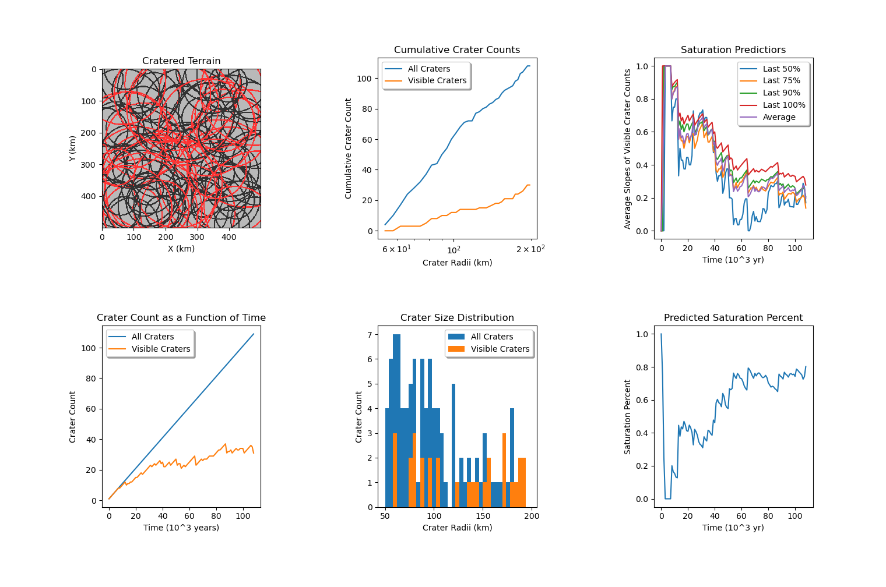

********
`Impact Crater Saturation Simulation`_
********

A simplified cratering simulation to model surface saturation written in Python.

Background
==========

Crater saturation is a phenomenon that occurs on planetary surfaces when the rate at which new craters form is roughly equal to the rate at which old craters are destroyed or erased. This can be identified when the number of craters on a surface remains constant over time, indicating that the surface has reached a state of equilibrium. Once a surface has reached saturation, observations of the rate at which new craters are forming can be used to estimate the time since saturation, providing a relative age for the surface.

Install Notes
=============

For imageio:

.. code:: bash

    pip install imageio
    pip install imageio[ffmpeg]
    pip install imageio[pyav]

Model Assumptions
=================

Consider a 500 km x 500 km planetary surface under the following assumptions:

* The rate of impacts is 1 every 1000 years.
* The minimum measurable crater size has a diameter of 10 km.
* A old crater is considered no longer visable when:

    * The new crater has a larger radius than the old crater.
    * The distance between the center of both craters is less than 60% of the the radius of the new crater.

* Effects such as erosion and secondary craters are ignored.
* All craters are simple craters.
* Crater radii are random under this distribution (weights smaller craters):

.. code:: python

    math.exp(random.uniform(math.log(self.minCraterRadius), math.log(self.maxCraterRadius)))

Notes on Graphics
=================

There are six figures that display data about each time-step of the simulation.

From right to left, top to bottom:

**Cratered Terrain:**

    Displays a visualization of the surface. The circles are crater rims. Red circles are craters that have hidden others.

**Cumulative Crater Counts:**

    Displays a radii binned graph of cumulative crater counts. One line displays all craters. One line displays Visible craters.
    
**Saturation Predictors:**

    Graphs average slopes at intervals of visible craters line (next plot)
    
**Crater Count as a Function of Time:**

    Graphs all craters as a function of time and visiable craters as a function of time.
    
**Crater Size Distribution:**

    Histogram of crater radii and the current counts (visible and all)
    
**Predicted Saturation Percent:**

    The perdicted saturation percent as a function of time.

Analysis
========

**Trial One**

The initial conditions were as follows:

    *See Usage section for parameter description*

.. code:: python
    
    sim = CraterSim(terrainLength=500, minCraterRadius=5, maxCraterRadius=50,
                    surfaceValue=185, craterValue=50, occlusionValue=0.6, fps=30)
    sim.generateCraters(steps=2500, binning=4, outlineMode=True)

The saturation point was reached at 1990 * 10^3 years

At 25% to saturation:

At 50% to saturation:

.. image:: t1saturation50.png
   :alt: 50 Percent 

At 75% to saturation:

At 100% of saturation:

The following video is an animation of trial one (click to watch):

.. image:: https://img.youtube.com/vi/b0bS3ki7gDE/maxresdefault.jpg
    :alt: IMAGE ALT TEXT HERE
    :target: https://www.youtube.com/watch?v=b0bS3ki7gDE

**Trial Two**

For trial two, the crater size distribution will be shifted. The minimum crater radius will be increased to 50 km. The maximum crater radius will be increased to 200 km. This will significantly decrease the time required to simulate before saturation can be detected. In a real senario this perhaps occur due to a rarity in non accreated material. Any impactors will have been formed from previously much smaller imactors.

The initial conditions were as follows:

    *See Usage section for parameter description*

.. code:: python
    
    sim = CraterSim(terrainLength=500, minCraterRadius=50, maxCraterRadius=200, 
                    surfaceValue=185, craterValue=50, occlusionValue=0.6, fps=15)
    sim.generateCraters(steps=200, binning=4, outlineMode=True)

The saturation point was reached at 108 * 10^3 years.

At 25% to saturation:

At 50% to saturation:

At 75% to saturation:

At 100% of saturation:

The following video is an animation of trial two (click to watch):

.. image:: https://img.youtube.com/vi/-zCqaES7dUY/maxresdefault.jpg
    :alt: IMAGE ALT TEXT HERE
    :target: https://www.youtube.com/watch?v=-zCqaES7dUY

**Conclusions**

By modeling crater deposition and covering it is possible to visualize the counts of visible craters as a function of time. When this function asymptotes to zero the surface can be considered saturated. This was demonstrated in two trials with differing crater size distributions.

In trial one 2500 time steps were used (simulating 2500 * 10^3 years / 2500 impacts). This lead to a 3+ hour compute time. The result generated however is quite a beautiful example of the cratering rate and crater removal rate reaching an equillibrium.

In trial two 200 time steps were used (simulating 200 * 10^3 years / 200 impacts). The compute time for this trial was on the order of ~10 minutes. The results as expected were much noiser yet still clearly reach an equillibrium state.

Besides noise differences all figures display the same end state:

 * Cratered Terrain has almost no visible surface gaps.
 * Cumulative Crater Counts (log-space) has a "steep" linear distribution for all craters and a much linear shallower distribution for visible craters.
 * Saturation Predictors initially start around a value of 1.0 and trend to 0.0.
 * Crater Count as a Function of Time shows how visible craters asymptotes off from the constant cratering rate as time increases.
 * Crater Size Distribution shows weighting towards small craters for "all craters" and a realtivly even distribution for visible craters.
 * Perdicted Saturation Percent seems to logrithmically approach 1.0.

Commenting on the Cratered Terrain figures: By saturation, especially for trial one, the terrain visually seems over saturated. This puts some doubt into the validity of the calculation for weather or not a crater is hidden. Further thoughts on this are discussed in "Further Development".

Commenting on Crater Count as a Function of Time: If a trial was computed with a much larger timescale than even trial one all craters would likely approach appearing as a constant y = K. This occurs as a result of the equilibria definition of crater saturation.

Commenting on the Crater Size Distribution at Saturation: The relativly even distribution is likely due to the surface "being at equilibrium". Any craters added remove other craters. This should be a negitive feedback system for any size concentrations (hence the even distribution).

Further Development
===================

A logical next step would be to rework the crater removal mechanics. Rather than computing (a rather abitrary) collision value, it would be significantly better to determine visible craters by measuring how many craters are detictable in the image of the surface. Methods of doing this could range from circle detection algorithms to a simple machine-learning image processing implementation. 

Additionally if the images of the surface are relativly comparable to real surfaces: real images of planetary surfaces could be fed in to this to count craters. Since real surfaces do not have cratering rates that are anywhere near the timescales run on the simulation it would be more intersting data-wise to try and estimate the ages of these surfaces (which would likely need more information besides crater numbers).

The collision detection that currently detects if craters are hidden likely could be improved via a quadtree datastructure. Another optimization would be changing how (especially filled) craters are drawn. When outlineMode is disabled drawing craters can cause significant computation time.

Usage
=====

Relevant code for running variatons of the simulation:

.. code:: python
    
    sim = CraterSim(terrainLength=500, minCraterRadius=5, maxCraterRadius=50,
                    surfaceValue=185, craterValue=50, occlusionValue=0.6, fps=30)
    sim.generateCraters(steps=2500, binning=4, outlineMode=True)
    
    
The above code uses the following parameters to initialize the simulation:

+------------------+-------------------------------------+
| Parameter        | Purpose                             |
+------------------+-------------------------------------+
| terrainLength    | Size of terrain square length (km). |
+------------------+-------------------------------------+
| minCraterRadius  | Minimum crater radius (km).         |
+------------------+-------------------------------------+
| maxCraterRadius  | Maximum crater radius (km).         |
+------------------+-------------------------------------+
| surfaceValue     | 0-255 color value for surface.      |
+------------------+-------------------------------------+
| craterValue      | 0-255 color value for craters.      |
+------------------+-------------------------------------+
| occlusionValue   | If the distance between a larger    |
|                  | new crater and a smaller old        |
|                  | crater is less than the new craters |
|                  | radius * this value: the old crater |
|                  | will be hidden.                     |
+------------------+-------------------------------------+
| fps              | Framerate of animation.             |
+------------------+-------------------------------------+
| steps            | Numer of 1000 years to simmulate.   |
|                  | This will also be the total number  |
|                  | of craters generated.               |
+------------------+-------------------------------------+
| binning          | Bin size for histogram.             |
+------------------+-------------------------------------+
| outlineMode      | When enabled draws filled in        |
|                  | craters. This is slower.            |
+------------------+-------------------------------------+
